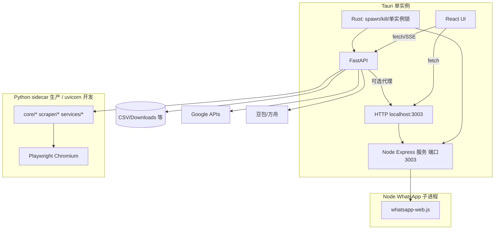

# Tauri + Python 后端重构 — 实施计划（v2）

> **说明：** 本计划在仓库既有文档 `.trae/documents/tauri_refactor_plan.md` 基础上**重写并收敛**：对齐**当前真实目录结构**、补全**功能还原矩阵**、合并 **Bug/缺口清单**，并采用 **writing-plans** 的粒度（可执行小步 + 可验证）。

**Goal:** 用 **Tauri v2 + React/TypeScript** 替换现有 **ttkbootstrap** 壳层；业务由 **FastAPI Python 服务** 承载并**完整还原** Google Maps 获客能力；**集成 WhatsApp 自动化**（来自 `E:\办公小程序\WhatsApp自动化库` 的 Node 服务）；目标安装包在**用户机无需预装 Python**；**禁止多开**；品牌继续沿用 **「B2B Global 获客系统」**。

**Architecture:** Tauri 壳负责 UI、**单实例锁**、本地文件对话框、**子进程编排**；**主业务**走 `127.0.0.1:<PY_PORT>` 的 FastAPI；**WhatsApp** 走同源或第二端口的 **Node（whatsapp-web.js）HTTP API**（默认 README 为 `http://127.0.0.1:3003`）。开发机用源码 + venv；**发布包**用 **PyInstaller 将 Python 后端打成 sidecar 可执行文件**（内嵌/携带 Playwright 浏览器资源，路径在首启时自检），Node 部分用 **便携 Node 运行时 + 打包后的 `whatsapp-service` 目录** 一并随安装包分发（或 Tauri `externalBin` 二选一，见 Phase F）。

**Tech Stack:** Tauri **2.x** · Vite · React **19** · TypeScript · Tailwind **4** · Python **3.11+**（构建机锁版本）· **FastAPI + Uvicorn** · Playwright · **Node LTS**（仅 WhatsApp 子系统）· 现有 `core/`、`scraper/`、`services/`。

---

## 产物决策（陈七 — 2026-05-12 已确认）

| 项 | 决策 | 实施要点 |
|----|------|----------|
| 用户机 Python | **不要求预装** | 发布形态以 **PyInstaller onefile/onedir sidecar** 为主；开发仍用 venv |
| WhatsApp | **做进产品**，与地图工具一体 | 以 `WhatsApp自动化库/whatsapp-web.js` 为上游能力：发布时 **vendor 进本仓库**（如 `third_party/whatsapp-service/`），避免安装包依赖 `E:\...` 绝对路径 |
| 多开 | **禁止** | 固定 **Python 端口** + **Node 端口**；Tauri **单实例**（文件锁或 `tauri-plugin-single-instance`）；二次启动唤起已存在窗口 |
| 品牌 | **沿用** | 窗口标题、`productName`、安装向导文案：**B2B Global 获客系统**（与现 `gui/app.py` 一致） |

**与旧脚本 `whatsapp_contacts.py` 的关系：** 保留为**可选迁移路径**（Google Sheet 读电话）；主能力以 **Node 库的扫码登录 + HTTP API**（`API.md`）为准，Python 侧仅 **代理/编排**（例如从地图 CSV 推送到 WA 广播 API），避免两套登录体系互相打架。

---

## 0. 与旧版计划的关系（保留 / 废弃 / 修正）

| 主题 | `.trae/documents/tauri_refactor_plan.md` | 本计划处理 |
|------|-------------------------------------------|------------|
| 总体阶段划分 | 可用 | 保留并**重排优先级**：先「后端 API + 契约」再「壳与 UI」 |
| `tauri-app/python_backend/` 嵌套目录 | 假设 | **改为**仓库根级 `backend/`（或 `api_server/`），避免 Python 包路径与 `node_modules` 纠缠；`tauri-app` 专前端 |
| 版本钉死（如 Playwright 1.40） | 可能过期 | 以 **`requirements.txt` 锁文件**（pip-tools）或 **uv** 锁为准，与当前 Playwright 对齐 |
| 文件映射表（`gui/app.py` 等） | 部分过时 | **以当前 `gui/app.py` + `gui/pages/*` 为准**重新映射 |
| Bug 列表 | 有价值 | **合并**至第 8 节，并补充 `fix_missing_features_plan.md` 中条目 |
| WhatsApp 工具 | 未覆盖 | **新增**parity 行（见功能矩阵） |
| OAuth / 敏感配置 | 轻描淡写 | **单独成章**（回调、密钥不落盘 Web 层） |

---

## 1. 当前仓库快照（2026-05-12）

**已存在且应视为「事实来源」：**

- **入口：** `main.py` → `gui.app.ScraperApp`（ttkbootstrap + Win11 Mica 效果）。
- **GUI 模块化已完成：** `gui/pages/{engine,ai_strategy,sync}_*.py`、`gui/components/*`、`gui/dialogs/keyword_library_dialog.py`、`gui/effects/*`。
- **业务核心：** `core/{scraper_controller,keyword_service,sync_service,config_service}.py`（与 `gui` 解耦程度需在后端封装时核实边界）。
- **抓取与集成：** `google_maps_scraper.py` 或 `scraper/` 下实现、`google_sheets_service.py`、`sheet_aggregator.py`、`ai_generator.py`、`data.py`（地理与行业数据）、`keyword_manager.py`、`async_utils.py`。
- **辅助工具：** `whatsapp_contacts.py`（Sheet→联系人，**P2 保留**）；**主集成**改为 `WhatsApp自动化库/whatsapp-web.js`（Node，见「产物决策」）。
- **Tauri 前端脚手架：** `tauri-app/package.json` 已含 React 19、Vite 8、Tailwind 4、Zustand、TanStack Table、Tauri CLI **2.x**；**尚无 `src-tauri/`** → Phase 1 必须补齐。

**结论：** 旧计划里「拆分 `gui_scraper.py`」大段**已被当前结构覆盖**；重构重点转向 **HTTP 化 + Tauri 壳 + 进程管理 + 契约测试**。

---

## 2. 目标架构（蓝图）



**进程模型（已拍板）：**

1. **开发：** Tauri `setup` → `uvicorn backend.main:app --port 8756`；另开终端 `node web.js`（或 npm script 同时起 Node）。  
2. **生产：** Tauri 启动 **`b2b-backend.exe`（PyInstaller）** + **`node.exe` + 打包目录**（whatsapp 服务），**顺序**：先 Node（若 WA 功能启用）或先 Python（按依赖实测调整）→ 双 `/health` 就绪后再显示 UI。  
3. **健康检查：** Python `GET /health`；Node 增加或沿用 `src/server` 下 **轻量 `/health`**（若无则补一行路由）。  
4. **退出：** 先停 Playwright → 停 FastAPI → 停 Node → 清端口；**单实例**保证不会留下第二套子进程。

**端口常量（建议写死在一处 Rust + 前端 env）：** 例如 `PY_BACKEND=8756`、`WA_SERVICE=3003`，与 WhatsApp 库 README 对齐；若冲突则首启弹窗提示一次并写回用户配置（**仍禁止多开**，不允许多端口多实例）。

---

## 3. 功能还原矩阵（必须对齐验收）

> 优先级：**P0** 发布必须；**P1** 强烈建议；**P2** 可迭代。  
> 每行在结项时要有 **「自动化或脚本化验收步骤」**（见第 10 节）。

| 域 | 能力 | 现状参考（Python） | P |
|----|------|-------------------|---|
| 获客引擎 | 行业/地理级联选择、手动地址 | `gui/app.py` 绑定 + `data.py` | P0 |
| 获客引擎 | 关键词输入、并发、开始/停止 | `EnginePage` + `ScraperController` | P0 |
| 获客引擎 | 实时日志、状态卡片（抓取/邮箱/同步） | `LogPanel`、`StatusCard` | P0 |
| 获客引擎 | 底部：同步到云端、汇总同步、测代理、开目录 | `fix_missing_features_plan.md` 已列 | P0 |
| 获客引擎 | 数据预览（含 `Downloads/` 会话目录、`lengdangb2b.csv`） | `DataPreviewWindow`、`gui/app.py` | P0 |
| 关键词库 | 弹窗：搜索、全选/反选、导入导出、删除、加载到引擎 | `keyword_library_dialog.py` + `keyword_manager.py` | P0 |
| AI 策略 | 模板编辑与持久化 | `AIStrategyPage` + `app_config.json` / `.env` | P0 |
| AI 策略 | 豆包/火山关键词生成、超时降级 | `ai_generator.py` | P0 |
| 同步设置 | 代理、Sheets ID、各 API Key、同步模式/冲突策略 | `SyncSettingsPage` + `config_service` | P0 |
| 同步设置 | 测试连接 / 代理 | 现有 `ScraperApp` 方法 | P0 |
| Google | OAuth、`token.json` 刷新、Sheets 上传/汇总 | `google_auth.py`、`google_sheets_service.py`、`sheet_aggregator.py` | P0 |
| 抓取 | Playwright 反检测、滚动终止、邮箱爬取 | `google_maps_scraper.py` + `email_extractor.py` | P0 |
| 系统 | 窗口尺寸记忆、配置恢复 | `gui/app.py` `_restore_config` / resize | P1 |
| 系统 | Win11 毛玻璃视觉 | 现 `gui/effects`；Tauri 可用 **原生透明/Mica** 或 CSS 近似 | P2 |
| WhatsApp | **扫码登录**、群发/联系人 API、与本工具 CSV 联动 | `third_party/whatsapp-service/`（源自 `WhatsApp自动化库/whatsapp-web.js`）+ `backend/routers/whatsapp_proxy.py`（可选薄代理） | **P0**（一级侧边栏或顶栏「WhatsApp」入口；未登录时显示引导扫码页） |
| WhatsApp | 旧：Sheet 批量脚本 | `whatsapp_contacts.py` | P2（CLI 保留；后续可改为调 Node API） |

---

## 4. 推荐目录布局（结项目标）

```
Google地图数据抓取工具/
  backend/
    main.py
    routers/                    # scraper / keywords / sync / config / logs / whatsapp_proxy(可选)
    adapters/
    schemas/
  third_party/                  # NEW：随安装包分发的上游快照（不依赖 E:\ 绝对路径）
    whatsapp-service/           # 自 WhatsApp自动化库 复制；内含 package.json、web.js、src/
  tauri-app/
    src/
    src-tauri/                  # spawn sidecar + node + 单实例
  core/ scraper/ services/ gui/
  docs/plans/
  tests/
  build/                        # PyInstaller spec、打包脚本（可选集中在此）
```

**原则：** 尽量 **不搬运** 大段业务逻辑；`backend/adapters` 只做 **线程池/asyncio 桥接**、**统一日志格式**、**取消令牌**。

---

## 5. 分阶段实施（可执行小步）

### Phase A — 契约与清单（1–2 天）

**A1.** 建立 `docs/parity-checklist.md`：从第 3 节矩阵逐条抄成 checkbox。  
**A2.** 画出 **OpenAPI**：先手写 `backend/schemas` + `/health`、`/scraper/status` stub。  
**A3.** 引入 **静态检查**：`ruff` + `pyright`/`mypy`（择一）对 `backend/`；前端 `eslint` 已有则复用。  
**验收：** `uvicorn` 能启动，前端 `curl` 通 `/health`。

### Phase B — Python HTTP 层「裹」现有核心（3–6 天）

**B1.** `POST /scraper/start` / `POST /scraper/stop` / `GET /scraper/status` → 委托 `ScraperController`（注意 **线程/asyncio** 与 Playwright 事件循环：必要时 `anyio.to_thread.run_sync` 或专用 worker 线程）。  
**B2.** `GET /logs/stream`：**SSE**（或 WebSocket）推送与当前 `LogPanel.append` 等价结构。  
**B3.** `keywords/*`：库读写、AI 生成，与 `KeywordService` 对齐。  
**B4.** `sync/*`：单文件、汇总、`sheet_aggregator` 参数（`target_title`、`by_date`、`conflict_resolution`）全部暴露。  
**B5.** `config/*`：读写 `.env` / `app_config.json` 的规则与 **GUI 当前行为**一致；**禁止**在响应中回显完整密钥（脱敏）。  
**验收：** 用 **httpx** 集成测试跑通「启动→收日志→停止」；无 UI。

### Phase C — Tauri `src-tauri` 与进程守护（2–4 天）

**C1.** `cargo tauri init` 对齐现有 `tauri-app` 前端（`beforeDevCommand` / `devUrl`）。  
**C2.** Rust：`spawn_python_backend()`、`wait_health()`、`kill_on_exit()`。  
**C3.** Tauri commands：`open_directory(path)`、`pick_file()`（替代部分 `filedialog`）。  
**C4.** **单实例（必做）**：`tauri-plugin-single-instance` 或命名互斥锁；第二进程 `exit` 并 `focus` 主窗。  
**C5.** **子进程编排表**：`PY_BACKEND`、`WA_SERVICE` 启动顺序、超时、崩溃重启策略（WA 进程崩溃最多 N 次/会话）。  
**验收：** `tauri dev` 起双服务；关窗后无残留 `python`/`node`/`chromium`；双开 exe 只保留一实例。

### Phase D — React 页面还原（5–10 天）

按旧计划页面拆分即可，但强制：  
**D1.** `EnginePage`：**必须**包含 fix plan 里的 4 个按钮与数据预览逻辑。  
**D2.** 关键词库：**模态**或独立路由，与弹窗 UX 对齐。  
**D3.** 状态管理：Zustand store 分片（`scraperSlice`、`configSlice`）避免单文件上帝对象。  
**D4.** 与 API 类型：自 OpenAPI 生成或手写 `types/api.ts`，**禁止**长期 `any`。  
**D5.** **WhatsApp 页**：嵌入 `http://127.0.0.1:3003`（iframe 或新 Webview 窗口二选一；若 Cookie 隔离有问题则优先 **外链浏览器** 打开扫码页 + 应用内仅展示状态轮询）；展示连接/配额/日志（读 `API.md`）。  
**验收：** 人工 + Playwright for Web（可选）对关键流录屏；WhatsApp 扫码一次后可从应用内触发「测试发信」接口（若上游提供）。

### Phase E — Google OAuth 与安全（2–4 天）

**E1.** 确认 OAuth 循环：**系统浏览器** 或 **嵌入式 Webview**（Tauri Webview 打开 localhost auth route）；回调写入 `token.json` 的路径与现逻辑一致。  
**E2.** `.gitignore` / `tauri.conf.json` 资源白名单：**绝不**打进前端的文件列表评审。  
**E3.** 日志脱敏：代理 URL、API Key 只显示前后 4 字符。  
**验收：** 新 clone 仓库无法意外泄露密钥（`git grep` 扫描）。

### Phase F — 打包与发布（5–8 天，含免 Python）

**F1.** **PyInstaller**：`backend` 入口 `uvicorn` 或自建 `run_backend.py`（先 `multiprocessing.freeze_support()`）；`hiddenimports` 覆盖 `playwright`、`google.*`、`pandas`；**数据文件**打包 `pages/`、`assets/`、`data.py` 依赖的静态资源、`keywords_library.json` 模板等。  
**F2.** **Playwright 浏览器**：`PLAYWRIGHT_BROWSERS_PATH` 指向安装目录下 `ms-playwright`（随包或首启下载二选一；**商业交付倾向随包**以符合「免配置」）。  
**F3.** **Node/WhatsApp**：将 `third_party/whatsapp-service` 与 **便携 node.exe**（或用户机已装 Node —— **不满足免配置目标**，故默认 portable）打入 `resources/`；Tauri `sidecar` 或 `Command::new` 用**绝对资源路径**启动。  
**F4.** Tauri `bundle > resources` 声明上述目录；`nsis`/`msi`；**产品名** `B2B Global 获客系统`。  
**F5.** 版本号：`tauri.conf.json` + Python `importlib.metadata` + WhatsApp 包 `package.json` **version** 三处脚本对齐。  
**验收：** 一台 **无 Python、无 Node** 的 Windows VM：安装后地图抓取 + WhatsApp 扫码 + 发一条测试消息全流程通过。

---

## 6. Bug / 技术债合并清单（须在重构中关闭或验证）

| ID | 描述 | 来源 | 处理要点 |
|----|------|------|----------|
| B1 | 日志级别过滤未实现 / 弱 | `log_panel.py` + 旧 Tauri 计划 | 前端过滤 + 后端带 `level` 字段 |
| B2 | AI 生成超时与降级不优雅 | `ai_generator.py` | `httpx` timeout + 重试 + 用户可见降级文案 |
| B3 | 抓取中浏览器崩溃恢复 | Playwright 层 | context 异常捕获 + 有限次重启 |
| B4 | Google token 过期刷新 | `google_auth.py` | 统一 `refresh`；API 返回 401 时触发刷新队列 |
| B5 | 并发抓取共享状态竞争 | `ScraperController` | `asyncio.Lock` / 队列串行化写 CSV |
| B6 | 「同步/汇总/测代理/开目录」与预览路径 | `fix_missing_features_plan.md` | **P0 验收** |
| B7 | `tauri-app` 无 `src-tauri` | 现状 | Phase C 首任务 |

---

## 7. 优化（非功能但影响交付）

- **可观测性：** 结构化日志（JSON line）+ 落盘 `logs/app.log`；前端只订阅摘要。  
- **性能：** 日志高频时 **节流**（100ms 合并）；表格虚拟化（数据预览）。  
- **依赖：** Python 用 **uv** 或 **pip-tools** 锁版本；与 README「3.11+」一致声明。  
- **CI：** GitHub Actions：`ruff` + `pytest` + `npm run build` + `cargo clippy`（可选）。

---

## 8. 建议优先「加载」的 Cursor 技能

在实现具体任务时，由 Agent **按需读取**（不要一次塞满上下文）：

- `writing-plans` / `writing-skills`：拆分后续子计划。  
- `executing-plans`：按任务顺序执行、每步可提交。  
- `systematic-debugging`：Playwright/Google OAuth 类问题。  
- `karpathy-guidelines`：控制改动面、先写测试再改内核。  
- `test-driven-development`：`backend/tests` 契约优先。

---

## 9. 已确认决策（无需再问）

已在 2026-05-12 与陈七对齐：**免用户机 Python（PyInstaller sidecar）**、**集成 WhatsApp 自动化库（Node，vendor 进仓库）**、**禁止多开**、**品牌名沿用 B2B Global 获客系统**。后续若变更端口或产品名，仅更新单一配置源并改本计划附录。

---

## 10. 结项验收脚本（示例）

1. 删除 `Downloads/` 下测试子目录 → 启动应用 → 跑 1 个短关键词 → 生成 CSV。  
2. 点「数据预览」→ 能打开 **本次会话目录** 或 `lengdangb2b.csv`。  
3. 「测试代理」→ 成功/失败提示与现网行为一致。  
4. 「同步到云端」「汇总同步」→ 在测试 Sheet 可见行（使用测试表 ID）。  
5. 关闭应用 → 任务管理器无残留 `python` / `node` / `chrome`（Playwright + Puppeteer/Chromium 视实际进程名为准）。  
6. **单实例：** 连续双击安装目录下 exe，仅一个主窗；第二次应激活已有窗口。  
7. **WhatsApp：** 应用内打开模块 → 扫码就绪 → 调 `API.md` 中一条低风险只读接口（如状态）再测写接口（若环境允许）。

---

## 11. 时间粗估（单人全职量级）

| 阶段 | 工作日 |
|------|--------|
| A 契约 | 1–2 |
| B 后端 | 3–6 |
| C Tauri 壳 | 2–4 |
| D 前端 | 5–10 |
| E OAuth/安全 | 2–4 |
| F 打包（含双 sidecar + Playwright 浏览器） | 5–8 |
| **合计** | **约 5–9 周**（免 Python + 双运行时打包拉长联调） |

---

**下一步建议：** 按 `docs/parity-checklist.md` 中 **Phase F** 在无 Python/Node 的 Windows VM 上完成安装包验收；OAuth 与 WhatsApp 广播请在测试账号环境操作。

---

## 12. Kickoff 执行记录（2026-05-12）

- [x] `backend/`：FastAPI 入口、`/health`、scraper/keywords/sync/config/whatsapp 路由骨架；`GET/POST /api/scraper/*` 已接 `ScraperController`。
- [x] `tests/test_backend_health.py`：`pytest` 通过。
- [x] `docs/parity-checklist.md`：验收清单。
- [x] `third_party/whatsapp-service/`：自 `WhatsApp自动化库` 同步（已删 `.wwebjs_auth*` 缓存目录；`.gitignore` 忽略会话路径）。
- [x] `tauri-app/src-tauri/`：`tauri init --ci`；`lib.rs` 拉起 `uvicorn`、退出时 `kill`；`tauri-plugin-single-instance`；`package.json` 增加 `tauri:dev` / `tauri:build`；`identifier` → `com.b2bglobal.scraper`。
- [x] 后续：React 通过 `VITE_API_BASE_URL`（默认 `http://127.0.0.1:8756`）轮询 `/health` 与 `/api/whatsapp/health`；Swagger/OpenAPI 已挂 `/docs`、`/openapi.json`（main 补全 tags 与描述）；Tauri 在 `B2B_SPAWN_WHATSAPP=1` 且已 `npm install` 时编排 `node web.js`；`backend/run_sidecar.py` + `build/pyinstaller/b2b-backend.spec` 骨架。
- [x] **Phase B（部分）**：`GET /api/logs/stream`（SSE）+ `LogBus` 接入 `ScraperController` 回调；`GET /api/meta/geography|industries`、`POST /api/meta/resolve-location`；`tests/test_api_phase_b.py`。
- [x] **Phase D（本轮）**：引擎底部四键；关键词库（搜索/全选/反选/导入导出/AI/应用）；完整 AI/同步/WhatsApp 页面；`google_oauth`、`whatsapp` 扩展路由；Tauri `reveal_path`、`whatsapp_service_*`、`window-state`。
- [x] **Phase E（应用内 OAuth）**：`/api/google/oauth/*` + 同步页操作；`google_auth` 凭证路径锚定仓库根；`.gitignore` 忽略 `client_secret.json` / `token.json`。
- [ ] **Phase F**：PyInstaller / 便携 Node / 浏览器随包 — 见 `docs/parity-checklist.md` Phase F 小节；需在无开发环境的 Windows VM 联调。
